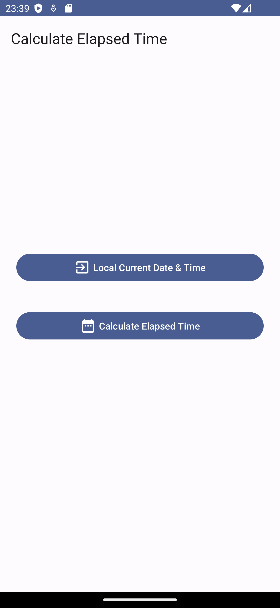
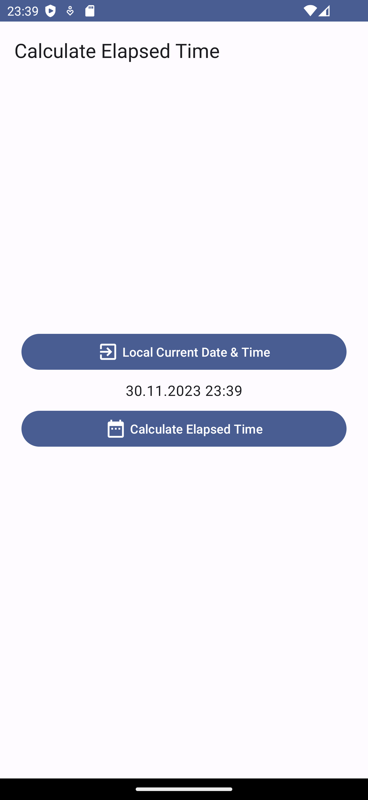
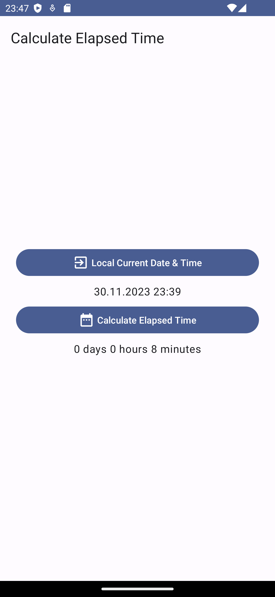

# Elapsed-Time App

This project; you can instantly find out the local date and time on the phone and calculate the elapsed time in day hour minute format with the calculation button.
If you want, you can change the date format or input the current time value yourself.

## Features

The main features of this project include:

- You can learn the current date and time data in the application.
- You can find out the elapsed time with the calculation button.

## Technologies

We utilized the following key technologies and tools in the development of this project:

- Jetpack compose toolkit was used in the application.
- Calculated using application local date format.

## User Interfaces

  
  
  
 

